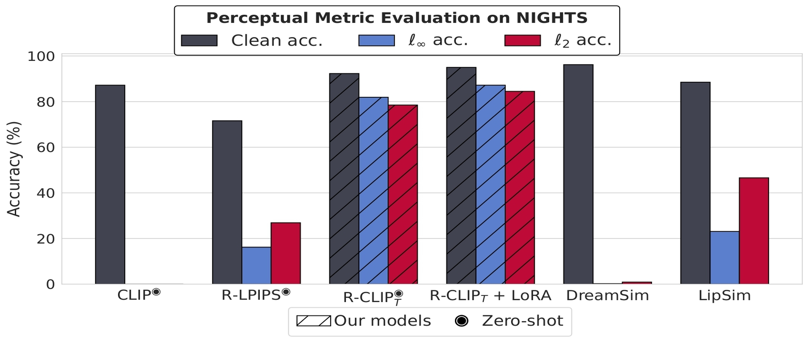

<div align="center">

<h1>Adversarially Robust CLIP Models Induce Better (Robust) Perceptual Metrics</h3>
</div>

---------------------------------

<p align="center">
    
</p>

[[Paper](https://openreview.net/forum?id=e3scLKNiNg&noteId=e3scLKNiNg)] [[BibTex](#citation)]

This repository contains code for the paper "Adversarially Robust CLIP Models Induce Better (Robust) Perceptual
Metrics".
We demonstrate that robust CLIP models induce state-of-the-art zero-shot perceptual similarity metrics _both_ in terms
of clean performance _and_ adversarial robustness. Moreover, we show that clean fine-tuning on the NIGHTS dataset
further improves these perceptual metrics in both aspects.

## Comparison with other perceptual metrics

We compare our proposed models against SOTA perceptual metrics on the NIGHTS
dataset ([Fu et al. (2023)](https://dreamsim-nights.github.io)).
We evaluate clean performance as well as robustness against adversarial attacks using threat models 
$\ell_\infty, \epsilon=4/255$ and $\ell_2, \epsilon=3$. More evaluations can be found in the paper.

| Method                      | Source                                                                | Backbone   | FT       | clean    | $\ell_\infty$ | $\ell_2$ |
|-----------------------------|-----------------------------------------------------------------------|------------|----------|----------|---------------|----------|
| LipSim Pretrained           | [Ghazanfari et al. (2024)](https://github.com/SaraGhazanfari/lipsim)  | SLL        | &#x2714; | 86.6     | 8.6           | 26.5     |
| LipSim Margin<sub>0.2</sub> | [Ghazanfari et al. (2024)](https://github.com/SaraGhazanfari/lipsim)  | SLL        | &#x2714; | 88.5     | 23.1          | 46.6     |
| LipSim Margin<sub>0.5</sub> | [Ghazanfari et al. (2024)](https://github.com/SaraGhazanfari/lipsim)  | SLL        | &#x2714; | 85.1     | 32.8          | 53.1     |
| R-LPIPS                     | [Ghazanfari et al. (2023)](https://github.com/SaraGhazanfari/R-LPIPS) | AlexNet    | &#x2718; | 71.6     | 16.2          | 26.9     |
| Dreamsim                    | [Fu et al. (2023)](https://dreamsim-nights.github.io)                 | Ensemble*  | &#x2718; | 90.8     | -             | -        |
| Dreamsim + MLP              | [Fu et al. (2023)](https://dreamsim-nights.github.io)                 | Ensemble*  | &#x2714; | 93.4     | -             | -        |
| Dreamsim + LoRA             | [Fu et al. (2023)](https://dreamsim-nights.github.io)                 | Ensemble*  | &#x2714; | **96.2** | 0.5           | 0.9      |
| R-CLIP<sub>T</sub>          | Ours                                                                  | ConvNeXt-B | &#x2718; | 92.3     | 81.9          | 78.5     |
| R-CLIP<sub>T</sub> + MLP    | Ours                                                                  | ConvNeXt-B | &#x2714; | 94.5     | 84.4          | 79.8     |
| R-CLIP<sub>T</sub> + LoRA   | Ours                                                                  | ConvNeXt-B | &#x2714; | 95.0     | **87.2**      | **84.5** |

*Dreamsim uses an ensemble of ViT-B/16 models obtained from CLIP, OpenCLIP, and DINO. Pretrained models for 
"Dreamsim" and "Dreamsim + MLP" were not available, however the robustness is expected to be similarly low as "Dreamsim +
LoRA".

## Example usage

**2AFC tasks:** to test a model on the NIGHTS dataset (either split), one can use

```python
python3 eval.py \
	--shortname <model_id> \
	--split [test_no_imagenet | test_imagenet] --dataset nights \
	--n_ex -1 --batch_size 100 --device 'cuda:0' \
	--model_dir <model_dir> --data_dir <data_dir> \
	#
	# Attacks flags (skip for clean accuracy only).
	--norm Linf --eps 4 \
	--n_iter 100 --attack_name apgd \
	--n_restarts 1 --use_rs
```

with a `model_id` from the pre-trained models after downloading the relative checkpoint.

### List of pre-trained models

| Model ID                     | Backbone   | Robust FT Method | NIGHTS FT | NIGHTS clean | NIGHTS $\ell_\infty$ | Checkpoint                                                              |
|------------------------------|------------|------------------|-----------|--------------|----------------------|-------------------------------------------------------------------------|
| `convnext_base_w`            | ConvNeXt-B | --               | --        | 87.2         | 0.0                  | HF                                                                      |
| `convnext_base_w-fare`       | ConvNeXt-B | FARE             | --        | 90.6         | 74.3                 | [Link](https://nc.mlcloud.uni-tuebingen.de/index.php/s/GCPXBDEE5PoCngy) |
| `convnext_base_w-tecoa`      | ConvNeXt-B | TeCoA            | --        | 92.3         | 81.9                 | [Link](https://nc.mlcloud.uni-tuebingen.de/index.php/s/zHKCC9aS7rf4qCt) |
| `mlp-convnext_base_w-fare`   | ConvNeXt-B | FARE             | MLP       | 92.5         | 78.2                 | [Link](https://nc.mlcloud.uni-tuebingen.de/index.php/s/Fb73e3i2PmWfwpN) |
| `mlp-convnext_base_w-tecoa`  | ConvNeXt-B | TeCoA            | MLP       | 94.5         | 84.4                 | [Link](https://nc.mlcloud.uni-tuebingen.de/index.php/s/2beeHj3DZNDbswZ) |
| `lora-convnext_base_w-fare`  | ConvNeXt-B | FARE             | LoRA      | 95.3         | 85.6                 | [Link](https://nc.mlcloud.uni-tuebingen.de/index.php/s/LxWHf7x9r3rXHPA) |
| `lora-convnext_base_w-tecoa` | ConvNeXt-B | TeCoA            | LoRA      | 95.0         | 87.2                 | [Link](https://nc.mlcloud.uni-tuebingen.de/index.php/s/f3dJ44YJkeY47Bj) |
| `vit-b-16`                   | ViT-B/16   | --               | --        | 85.1         | 0.0                  | HF                                                                      |
| `vit-b-16-fare`              | ViT-B/16   | FARE             | --        | 90.6         | 71.5                 | [Link](https://nc.mlcloud.uni-tuebingen.de/index.php/s/fg7JHQzASiNnxCg) |
| `vit-b-16-tecoa`             | ViT-B/16   | TeCoA            | --        | 91.9         | 79.4                 | [Link](https://nc.mlcloud.uni-tuebingen.de/index.php/s/ZBkmbMrAwgfeeSa) |
| `mlp-vit-b-16-fare`          | ViT-B/16   | FARE             | MLP       | 92.7         | 75.9                 | [Link](https://nc.mlcloud.uni-tuebingen.de/index.php/s/yYSM3pd7acJGZRq) |
| `mlp-vit-b-16-tecoa`         | ViT-B/16   | TeCoA            | MLP       | 93.7         | 82.1                 | [Link](https://nc.mlcloud.uni-tuebingen.de/index.php/s/BLL8c8DbBxX8RsB) |
| `lora-vit-b-16-fare`         | ViT-B/16   | FARE             | LoRA      | 95.7         | 80.9                 | [Link](https://nc.mlcloud.uni-tuebingen.de/index.php/s/jNwtQKK3oareL83) |
| `lora-vit-b-16-tecoa`        | ViT-B/16   | TeCoA            | LoRA      | 94.6         | 81.5                 | [Link](https://nc.mlcloud.uni-tuebingen.de/index.php/s/6aG2kPbpqCjodic) |

The model used in the teaser figure above is `convnext_base_w-tecoa`.

## Citation

If you find this work useful, please consider citing our paper:

```bibtex
@inproceedings{croce2024adversarially,
  title={Adversarially Robust CLIP Models Induce Better (Robust) Perceptual Metrics},
  author={Croce, Francesco and Schlarmann, Christian and Singh, Naman Deep and Hein, Matthias},
  booktitle={ICML 2024 Workshop on Foundation Models in the Wild}
}
```